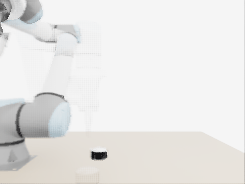

# Схват по RGB-D через RL (Isaac Sim, UR10e)



*Обученный агент на настоящей руке: по снимку сверху выбирает, куда и под каким углом хватать, рука едет из домашней позы, берёт банку и поднимает.*

## Попробовать агента самому

Обученный агент и всё для запуска лежит в `agent/`, подробно - в `agent/README.md`. Скачать только его (без остального репо):

```bash
git clone --filter=blob:none --no-checkout https://github.com/LeonidNN/isaac-rgbd-grasping.git grasp_agent
cd grasp_agent
git sparse-checkout set --no-cone agent assets/usd MetaIsaacGrasp/models/ur10e_with_hand_e_and_camera_mount.usd
git checkout main
```

Дальше два варианта:
- без симулятора, на любом компе (`pip install torch matplotlib`): ставишь объект куда хочешь и смотришь, куда агент хватает и насколько уверен
  ```bash
  python agent/agent.py                               # готовые сцены
  python agent/agent.py tetrapak-lying -0.1 0.45 30   # свой объект: тип, x, y (метры), угол
  ```
  картинка будет в `agent/out/put.png`
- в Isaac Sim 4.5 + Isaac Lab 2.0 на RTX-видюхе: `python agent/sim.py fast` (8 столов разом) или `python agent/sim.py arm` (рука едет к объекту), SR и гифки в `agent/out/`

---

Тестовое задание. В Isaac Sim стоит UR10e с захватом Robotiq Hand-E, на столе лежит одна из трёх вещей: тетрапак, банка или пакет чипсов. Камера сверху делает снимок, агент по нему решает куда и под каким углом хватать, рука хватает сверху (сбоку очень сложно) и поднимает. Если поднял на 10 см и больше (и продержал 1 с) - успех.

За основу взял MetaIsaacGrasp (https://github.com/YitianShi/MetaIsaacGrasp), оттуда сцена, робот и контроллер. Isaac Sim 4.5 + Isaac Lab 2.0. Гонял всё на общем сервере лаборатории на RTX 2080 Ti.

## Если коротко

- сделал сцену, объекты, среду с рандомизацией. оракул (он подглядывает настоящую позу объекта) берёт тетрапак и банку 10/10, мой baseline по глубине без всякого обучения 11/11
- агент это Q-карта. первая попытка провалилась, там же нашёл баг с рендером (цвет от прошлой сцены). во второй поменял сразу несколько вещей - убрал цвет, разрешил хватать только по объекту, медленнее снижал eps, больше столов - и она научилась (12 ч): жадно тетрапак 93%, банка 89%, а на настоящей руке 18/20 и 19/20. какая из правок повлияла - не мерил
- чипсы почти не берёт вообще никто, даже оракул. пакет тупо шире чем раскрываются пальцы
- везде пишу 95% доверительные интервалы, неудачные прогоны тоже лежат, рядом с каждым прогоном лежит код той версии

## Структура репозитория

- `grasp/` - мой код: среда `env.py`, зрение по глубине `vision.py`, baseline `baseline.py`, мой планировщик `planner.py`
- `results/` - все прогоны по порядку, в каждой папке код той версии, логи, картинки и гифки. общее описание в `results/README.md`
  - `1_setup`, `2_objects` - завёл сцену и объекты (модели с Freepik перегнал в USD)
  - `3_grasp` - учился хватать. сверху норм, сбоку перепробовал 10 версий
  - `4_env` - среда с рандомизацией, хватает оракул
  - `5_baseline` - baseline без обучения
  - `6_rl` - RL. `1_rgbd/` первая попытка, `2_depth/` вторая, `3_arm/` агент на настоящей руке, `analysis/` сводные картинки и таблица
- `agent/` - обученный агент, чтоб попробовать самому (см. в самом начале)
- `infra/`, `server/` - всё для запуска на сервере (одна видюха, вачдоги, бэкапы, перезапуск если упало)
- `assets/` - модели объектов

## Как все устроено

Один эпизод = один шаг: снимок -> агент выбирает позу схвата -> скрипт подъезжает, сжимает пальцы, поднимает -> награда 1 или 0.

Рандомизация каждый эпизод:
- объект случайный из трёх
- положение: X от -0.2 до 0.2 м, Y от 0.35 до 0.65 м перед роботом (это точка начала координат объекта, верх стола на z = 0)
- поворот вокруг вертикали случайный 0-360 градусов
- поза: тетрапак стоит или лежит, банка стоит, чипсы лежат (лицом вверх или вниз)
- свет не меняю

Агент - Q-карта (идею взял из статьи Zeng et al. 2018 Visual Pushing-Grasping, только сеть у меня сильно проще):
- на вход карта высот 128x128 над куском стола 70x70 см, считается из глубины RGB-D камеры
- сеть маленький U-Net, на выходе 8 карт 128x128 - для каждой клетки и каждого из 8 углов (через 22.5 градуса) сеть говорит какой шанс что схват туда сработает
- хватаю туда где шанс больше всего, но только среди клеток на объекте. высоту схвата агент не выбирает, она по правилу (верх объекта минус 3 см)
- учу так: после попытки знаю взял или нет, и подтягиваю выход сети в этой клетке к 1 или 0 (BCE). по сути это Q-learning где эпизод из одного шага. плюс буфер опыта, eps-greedy (eps с 0.5 до 0.1 за 8 часов), Adam 1e-4
- учится в упрощённой среде: 8 столов сразу, рука телепортом встаёт на 10 см над точкой и дальше только спуск, сжатие, подъём. так одна попытка 1-2 с, а с честным подъездом руки было около 1-2 минут

Ещё пробовал SAC (актор сразу выдаёт x, y и угол), но он не научился, начал всегда тыкать в центр стола.

## Ход работы

Делал по шагам, на каждом шаге сначала проверял, что предыдущее реально работает. Каждый прогон лежит в `results/` вместе с кодом той версии, неудачные тоже.

1. **Сервер и Isaac Sim** (`results/1_setup`, `server/`, `infra/`). Карты с RT-ядрами (они нужны для рендера камеры) есть только на одном сервере лаборатории - две RTX 2080 Ti, остальное A100 и они заняты другими. Там Ubuntu 20.04 со старой glibc, а Isaac Sim 4.5 хочет новее - пришлось перешить окружение на свою glibc. Хуже было с видюхами: сервер общий, а рендер Isaac Sim через Vulkan видит все 8 карт и плевать хотел на CUDA_VISIBLE_DEVICES, при первом же запуске полез на чужую A100. Написал свой Vulkan-слой, который прячет от моего процесса чужие карты, и `server/run.sh` - единственный способ запуска: проверяет карту, сторожит память и чужие процессы, сам убивает своё, если что-то не так.

2. **Сцена** (`results/1_setup`). Взял сцену и робота из MetaIsaacGrasp. Стол и пол из Nucleus с сервера не грузились (текстуры качаются с адреса, который оттуда недоступен, и рендер просто висит) - сделал их коробками. Повесил камеру сверху, проверил, что IK доводит кисть куда надо (ошибка 0.0 мм).

3. **Объекты** (`results/2_objects`). Модели с Freepik перегнал в USD, подогнал размеры под реальные (тетрапак 6x6x19 см, банка 8 см в диаметре, пакет чипсов 15x22x5 см). Покидал их на стол и посмотрел, как они могут лежать: тетрапак стоит и лежит, банка только стоит (на боку катится), чипсы только лежат.

4. **Схват сверху** (`results/3_grasp/top_ok`). Сначала мазал, оказалось что в USD пальцы Hand-E торчат по оси y кисти, а не по z, как в URDF. Поправил - взял.

5. **Схват сбоку, 10 версий** (`results/3_grasp/side_*`). В задании можно и сбоку, поэтому попробовал. Рука то сносила коробку по дороге, то не дотягивалась, то крутилась через саму себя. Написал свой планировщик (кинематика UR10e по DH, сошлась с симом до 0.0 мм, IK сразу пачкой, столкновения шариками). Сначала он вёл все суставы разом по прямой в пространстве суставов, и по графикам план/факт было видно, что рука не успевает за целью и срезает углы: сильнее всего отставание копится там, где меняется фаза движения - рука ещё не доехала, а цель уже поехала дальше (до 0.16 рад, v7). Замедлил в 2 раза и добавил паузы 0.5 с между движениями (v8) - отставание стало меньше (0.12 рад), но рука всё равно во что-то упиралась. Тогда сделал, чтоб суставы крутились строго по одному, «лесенкой»: следующий начинает, только когда предыдущий доехал, и между ними пауза. Так рука идёт ровно по тому пути, который планировщик проверил на столкновения, а не срезает. В v9 наконец взял (поднял на 10.9 см), но датчики контактов показали, что камера на запястье по дороге упирается в стол (до ~1000 Н), а её в моей модели столкновений вообще не было. Решил, что для таких низких объектов с такой кистью сверху надёжнее, и дальше агент хватает только сверху.

6. **Среда с рандомизацией и оракул** (`results/4_env`). Каждый эпизод случайный объект, место, поворот и поза. Оракул - скрипт, который подглядывает настоящую позу объекта, - чтоб проверить, что сама среда вообще работает. Тетрапак и банка 10/10, чипсы 0/10 - пакет шире, чем раскрываются пальцы (8.5 см). Заодно выяснил, вдоль чего сходятся пальцы: оракул с углом 0 взял лежачий тетрапак 10/10, с углом 90 - 3/10.

7. **Baseline без обучения** (`results/5_baseline`). Правило по карте глубины: нашёл объект, взял центр, повернул пальцы поперёк короткой стороны, рука едет моим планировщиком. Тетрапак 11/11, банка 11/11. Нюансы: у самого робота кисть закрывает край стола на снимке, ограничивая обзор камеры, а у низкой банки пальцы упираются в стол - на успех не повлияло, оставил как есть.

8. **Как учить** (`results/6_rl`). С честным подъездом руки одна попытка занимает 1-2 минуты, а PPO нужны десятки тысяч попыток - не успеть. Поэтому сделал быструю среду: несколько столов в одном процессе, рука телепортом встаёт на 10 см над точкой и дальше только спуск, сжатие, подъём (~1-2 с на попытку). И взял алгоритмы, которые учатся на старом опыте из буфера: Q-карту и SAC.

9. **Попытка 1, ночь 05.10** (`results/6_rl/1_rgbd`). Q-карта и SAC по 8 часов параллельно на двух 2080 Ti, на входе RGB + глубина. Не научился ни один: Q-карта ~7%, SAC выродился в «всегда в центр стола». Утром по картинкам увидел, что цвет и глубина у агента показывают разные сцены. Проверил (`results/6_rl/2_depth/rgb_check`): если мгновенно переставить объекты, RTX отдаёт цветной кадр с опозданием - после 2 рендеров ещё прошлая сцена, после 4 каша из старой и новой, после 8 нормально. Глубина при этом сразу правильная. Это объяснило и бледный цвет, а провал - видимо, частично.

10. **Попытка 2, 05-06.10** (`results/6_rl/2_depth`). Только Q-карта. Поменял сразу несколько вещей: цвет на вход больше не даю (для схвата сверху он ничего не добавляет), хватать разрешил только по клеткам на объекте, eps опускал гораздо медленнее (за 8 часов), 8 столов вместо 4, стартовал с весов первой попытки. Интересно, что сразу после смены входа, ещё без дообучения, та же сеть взяла 9 из 19 - значит, по глубине она за ночь кое-чему научилась, но что-то её сбивало. Первые 1.5 часа роста не было, потом пошёл: по часам 36 -> 54 -> 70 -> 80 -> 86% и плато. Какая из правок дала больше - не мерил.

11. **Насколько точно надо хватать** (`results/6_rl/analysis`). По логам второй попытки построил карту, где схват срабатывает. Банку берёт, только если ткнуть ближе ~2 см к центру, у тетрапака ещё и угол важен. И вылезло неожиданное: банка круглая, но угол пальцев всё равно важен (видимо, как повёрнута кисть относительно робота) - агент сам это выучил и почти всегда берёт банку под одним углом.

12. **Проверка на настоящей руке** (`results/6_rl/3_arm`). Агент выбирает точку, а рука едет из домашней позы моим планировщиком, как у baseline. Тетрапак 18/20, банка 19/20 - почти столько же, сколько в упрощённой среде, где он учился.

13. **Пакет для запуска** (`agent/`). Собрал веса и минимум кода, чтоб агента можно было скачать и потыкать самому - без симулятора («поставь объект и посмотри, куда он хватает») или в Isaac Sim.

## Результаты

SR (доля успехов), в скобках 95% доверительный интервал Уилсона.

| | тетрапак | банка | чипсы |
|---|---|---|---|
| оракул (знает позу) | 10/10 [72-100%] | 10/10 [72-100%] | 0/10 [0-28%] |
| baseline: глубина + правило + планировщик | 11/11 [74-100%] | 11/11 [74-100%] | - |
| **Q-карта, попытка 2 - обучение** (последние 4 ч, 10% попыток случайные) | 2907/3331 = 87% [86-88%] | 2946/3468 = 85% [84-86%] | 1/3593 = 0% [0-0%] |
| **Q-карта, попытка 2 - инференс** (жадно, последние 6 проверок) | 54/58 = 93% [84-97%] | 64/72 = 89% [80-94%] | 0/62 = 0% [0-6%] |
| **Q-карта, попытка 2 - инференс на настоящей руке** (рука едет моим планировщиком) | 18/20 = 90% [70-97%] | 19/20 = 95% [76-99%] | - |
| Q-карта, попытка 1 - инференс | 4/41 = 10% [4-23%] | 3/43 = 7% [2-19%] | 0/44 = 0% [0-8%] |
| SAC, попытка 1 - инференс | 0/39 [0-9%] | 0/39 [0-9%] | 0/50 [0-7%] |

Обучение и инференс без пометки - в упрощённой среде (рука телепортом над точкой), «на настоящей руке» - рука едет из домашней позы, как у baseline. Полная таблица с оракулом в быстрой среде - `results/6_rl/analysis/summary_table.md`.

Время обучения: первая попытка 8 ч Q-карта и 8 ч SAC (параллельно на двух 2080 Ti, примерно по 5.7 тыс. попыток). Вторая попытка 12 ч на одной 2080 Ti, 28488 попыток, стартовала с весов первой. Оценка на руке - 24 мин на 40 эпизодов.

Что получилось:
- в первой попытке был мой баг: RTX отдавал цветной кадр от прошлой сцены (2 рендера после перестановки мало, надо 8+), и сеть училась на картинках, где цвет и глубина про разное. Нашёл, проверил, починил, подробно в `results/6_rl/analysis/README.md`. Скорее всего, это одна из причин провала, но не единственная - см. дальше
- во второй попытке оставил только глубину (для схвата сверху цвет ничего не даёт, а камера всё равно RGB-D) и разрешил выбирать точку только на объекте. Вторая попытка стартовала с тех же весов, на которых закончилась первая: в конце ночи эта сеть брала ~7% на обучении и 0 на последних проверках, а сразу после смены входа, без единого шага дообучения - 9 из 19 на проверке (~47%), и потом на обучении сразу ~35%. Сеть та же, выучить что-то новое она не успела - значит, по глубине она за ночь кое-чему научилась, но это прятали две вещи: цвет от другой сцены её сбивал, а тычки в пустой стол и кисть давали гарантированный провал. Какая из двух мешала сильнее - пока не знаю, поменял обе сразу. А дальше за первые 1.5 ч дообучения роста не было, держалось на ~35%, проверки 47% -> 52% (в пределах шума) - я уже думал, что сеть выучила только «хватай где-то на объекте». Но на 3-м часу, когда eps пошёл вниз, пошёл и рост: по часам 36 -> 39 -> 54 -> 64 -> 70 -> 75 -> 80 -> 83 -> 86% и плато. На тепловых картах в начале ровное пятно на весь объект, к концу яркий пик в центре (`results/6_rl/2_depth/train_qmap_d/viz/curves.png`, `qmap_*.png`)
- на настоящей руке почти ничего не потерял: в упрощённой среде 93% / 89%, на руке 18/20 и 19/20 (`results/6_rl/3_arm/eval_20x2/`)
- из карты допуска вылезло интересное: банка круглая, но угол пальцев всё равно важен - видимо, как повёрнута кисть относительно робота. Агент сам это выучил и почти всегда берёт банку под одним углом (112.5°). Подробно в `results/6_rl/analysis/README.md`
- хватать надо прям точно: банку только ближе ~2 см к центру, у тетрапака ещё и угол (`results/6_rl/analysis/tolerance_map.png`)
- чипсы не берёт ни оракул, ни baseline, у агента 1 случайный успех на ~1000. пакет 15x22 см, а пальцы раскрываются на 8.5 см, сверху его просто не обхватить
- до baseline (11/11 на объект) агент в итоге почти дотянул, но на моих выборках не обогнал: у агента 90-95%, у baseline 100%, интервалы перекрываются. Зато baseline - это правило, которое я написал руками, а агент сам выучил, куда и под каким углом хватать
- SAC (попытка 1) не научился вообще, вторую попытку для него не делал

## Картинки и видео

Осторожно, на картинках `qmap_*.png` легко перепутать стоячий тетрапак с банкой: сверху тетрапак это тоже маленький квадратик 6x6 см. Различать по второму ряду (карта высот): тетрапак высокий (19 см), поэтому белый, а банка низкая (3.8 см), поэтому тёмно-серая. Подписи над картинками правильные. На картинках первой попытки (`6_rl/1_rgbd/`) цвет правда не совпадает с подписями - это тот самый баг с рендером, оставил как было.

- сводная таблица, карта допуска, график первая попытка против второй - `results/6_rl/analysis/`
- графики обучения итогового агента - `results/6_rl/2_depth/train_qmap_d/viz/curves.png`
- куда целится агент (кадр с крестиком, карта высот, тепловая карта сети) - `results/6_rl/2_depth/train_qmap_d/viz/qmap_*.png`: `qmap_000000.png` до дообучения, `qmap_028488.png` в конце
- видео агента сбоку (`*_ok.gif` взял, `*_fail.gif` не взял): в упрощённой среде - `results/6_rl/2_depth/train_qmap_d/viz/video_*.gif`, на настоящей руке - `results/6_rl/3_arm/eval_20x2/*.gif`, у baseline - `results/5_baseline/plan_11x2/*.gif`
- первая попытка (неудачная, с багом) - `results/6_rl/1_rgbd/`
